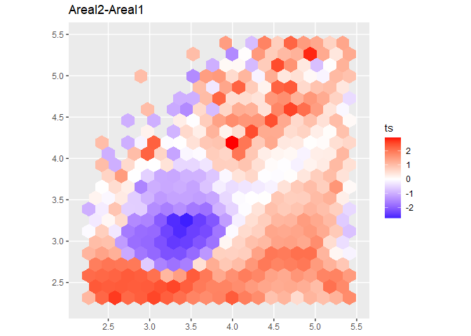
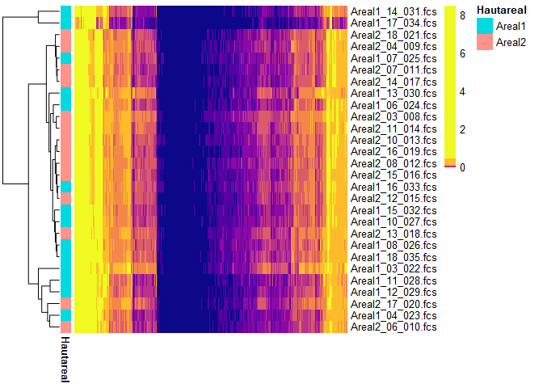
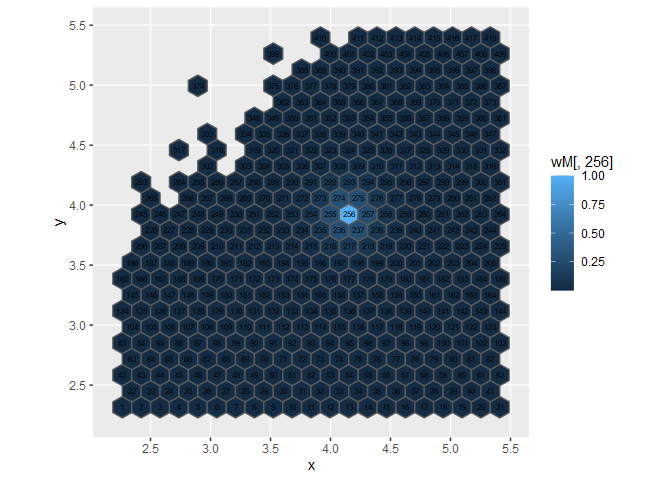

-   [HexTemplatesFCS](#hextemplatesfcs)
    -   [Installation](#installation)
-   [Instructions](#instructions)
    -   [Part 1: Read .fcs-files and
        metadata](#part-1-read-.fcs-files-and-metadata)
    -   [Part 2: Creating necessary data
        structures](#part-2-creating-necessary-data-structures)
        -   [Part 2.1: Creating a hexagon
            template](#part-2.1-creating-a-hexagon-template)
        -   [Part 2.2: Creating a frequency
            table](#part-2.2-creating-a-frequency-table)
        -   [Part 2.3: Creating a distance
            matrix](#part-2.3-creating-a-distance-matrix)
    -   [Part 3: Output](#part-3-output)
        -   [Part 3.1: Plotting the
            template](#part-3.1-plotting-the-template)
        -   [Part 3.2: Calculate and plot
            t-scores](#part-3.2-calculate-and-plot-t-scores)
        -   [Part 3.3: nmds-plot](#part-3.3-nmds-plot)
        -   [Part 3.4: Heatmap](#part-3.4-heatmap)
        -   [Part 3.5: adonis (PERMANOVA)](#part-3.5-adonis-permanova)
    -   [Part 4: Customizing the plots](#part-4-customizing-the-plots)
    -   [Part 5: Additional information](#part-5-additional-information)

<!-- README.md is generated from README.Rmd. Please edit that file -->
<!-- knitr::knit("README.Rmd") -->

HexTemplatesFCS
===============

<!-- badges: start -->
<!-- badges: end -->

The goal of HexTemplatesFCS is to quickly and easily generate data
structures that make it easy to get statistical output starting from raw
fcs-files and a metadata table. The grid approach is especially useful
if there aren’t any populations clearly visible in the files.

Installation
------------

You can install the development version of HexTemplatesFCS from GitHub
with:

    library(devtools)
    install_github("AG-ESSER/HexTemplatesFCS")

Instructions
============

Part 1: Read .fcs-files and metadata
------------------------------------

The .fcs-files should already be cleaned up. The metadata table should
preferably be saved in .csv or any other easy to read format. The rows
of the metadata table should correspond to the .fcs-files in
alphabetical order (e.g. sample\_01.fcs, sample\_02.fcs,…,
sample\_10.fcs). The *flowCore* library is needed for reading .fcs
files.

    library(flowCore)

    setwd("C:/Users/student.esser/FACSDATA/FCS_skin_microbiome")  #set working directory
    fcs <- read.flowSet(pattern = ".fcs")                         #read all .fcs-files in directory
    metadata <- read.table("metadata.csv", sep = ";", header = T) #read metadata table

Example metadata table:

    head(metadata[,1:4])
    #>   Sample.ID Hautareal Geschlecht Datum.Probenentnahme
    #> 1         1    Areal1       Male           17.08.2020
    #> 2         3    Areal1     Female           19.08.2020
    #> 3         5    Areal1       Male           20.08.2020
    #> 4         7    Areal1     Female           20.08.2020
    #> 5         9    Areal1       Male           20.08.2020
    #> 6        11    Areal1     Female           21.08.2020

Part 2: Creating necessary data structures
------------------------------------------

### Part 2.1: Creating a hexagon template

Check the available channels:

    colnames(fcs)
    #>  [1] "FSC-A"  "FSC-H"  "SSC-A"  "SSC-H"  "FITC-A" "FITC-H" "APC-A"  "APC-H" 
    #>  [9] "DAPI-A" "DAPI-H" "Time"

Create the HexTemplate:

    library(HexTemplatesFCS)

    hexT <- HexTemplate(flowset = fcs, xChannel = "SSC-H", yChannel = "FITC-H", xbins = 20, metadata = metadata, trans_fun = log10)

Every further output will be based on this template. The *flowset*
argument takes the flowSet we acquired by reading the .fcs-files in part
\\1. For the *xChannel* and the *yChannel* argument select the channels
you are interested in examining. The number of *xbins* correspond to the
number of hexagons on the x-axis - 1. This should be at least 20. Lastly
give your metadata table to the *metadata* argument. Give a function to
transform your data to the trans\_fun argument. Standard is log10. When
no data transformation should be done use *return*. The content of a
HexTemplate can be inspected using *View(hexT)*.

### Part 2.2: Creating a frequency table

    freq <- frequencies(hexT)
    head(freq[,1:4])
    #>                          [,1]      [,2]      [,3]      [,4]
    #> Areal1_03_022.fcs 0.007333333 0.2153333 0.2820000 0.2593333
    #> Areal1_04_023.fcs 0.014666667 0.2693333 0.3560000 0.3426667
    #> Areal1_06_024.fcs 0.006666667 0.3033333 0.4153333 0.4220000
    #> Areal1_07_025.fcs 0.024955960 0.4139753 0.4947152 0.5020552
    #> Areal1_08_026.fcs 0.016000000 0.3013333 0.4013333 0.4073333
    #> Areal1_10_027.fcs 0.014666667 0.3266667 0.4086667 0.4393333

In the HexTemplate’s count slot, the events that fall into any given
hexagon are stored as absolute values. The *frequencies*-function
recalculates those values in relation to the overall number of events in
a sample. This way comparison between samples is possible independently
of the number of events recorded for each sample.

### Part 2.3: Creating a distance matrix

    distM <- weightedBray(hexT)
    head(as.matrix(distM)[,1:2])
    #>           1         2
    #> 1 0.0000000 0.4641299
    #> 2 0.4641299 0.0000000
    #> 3 0.4487567 0.4114543
    #> 4 0.4750236 0.3922473
    #> 5 0.4143980 0.3669798
    #> 6 0.4241061 0.3715834

Calculate a distance matrix for every combination of samples. The
*weightedBray* function automatically adjusts for spatial dependencies.
If no adjustments should be done the *vegdist* function from the *vegan*
package can be used in conjunction with the frequency table from part
2.2.

Part 3: Output
--------------

### Part 3.1: Plotting the template

Plot the empty template

    plot(hexT)

Plot the template filled with sample no. 5

    plot(hexT, sample = 5)

### Part 3.2: Calculate and plot t-scores

Calculate t-scores between a metadata group for every hexagon and use it
as a measurement of difference.

    ts <- tscores(hexT, "Hautareal")

This returns a data.frame of t-scores with the columns representing
every possible unique combination of levels in the treatment\_dose
metadata group. Check the indices with *head(ts)*.

    head(ts)
    #>      Areal2-Areal1
    #> [1,]      1.075143
    #> [2,]      2.198518
    #> [3,]      2.658937
    #> [4,]      2.178130
    #> [5,]      2.306088
    #> [6,]      2.557509

Plot the differences between the levels of the Hautareal metadata group.
Use *drop = F* to show plot title.

    plot_tscores(hexT, ts, color = NA)

Automatically create polygon gates based on this index.

    gates <- detectGates(hexT, ts, conc = 5, thresh = 3, nM = 3, tSeed = 248)
    #> [1] "Seed for this configuration: 248"

Turn into simple features object and plot

    library(sf)
    #> Linking to GEOS 3.8.0, GDAL 3.0.4, PROJ 6.3.1
    library(ggplot2)

    psf <- st_polygon(gates)

    plot_tscores(hexT, ts, color = NA) + 
      geom_sf(data = psf, fill = NA)

### Part 3.3: nmds-plot

Visualize the difference between every sample in the template using a
nmds-plots using *vegan’s* *metaMDS*. A single point represents a
sample/.fcs-file. You can use either the frequency table or the distance
matrix as calculated in part 2.

    library(vegan)

    nmd <- metaMDS(distM, trace = F)

    ordiplot(nmd, display = "sites")
    ordispider(nmd, groups = meta.data(hexT)[,"Hautareal"])
    ordiellipse(nmd, groups = meta.data(hexT)[,"Hautareal"], label = T, draw = "polygon")

### Part 3.4: Heatmap

Use any heatmap library available and the frequency table we calculated
in part 2 to plot a heatmap. In this example we’re using the *pheatmap*
library:
(<a href="https://slowkow.com/notes/pheatmap-tutorial/" class="uri">https://slowkow.com/notes/pheatmap-tutorial/</a>)

    library(pheatmap) #or any other heatmap library
    library(viridis)  #for color scale

    mat_breaks <- quantile(freq, probs = seq(0, 1, length.out = 10))
    mat_breaks <- mat_breaks[!duplicated(mat_breaks)]

    pheatmap(freq, 
             annotation_row = meta.data(hexT)[,c("Hautareal"), drop = F], #your metadata groups
             color = plasma(length(mat_breaks)-1),
             breaks = mat_breaks,
             treeheight_col = 0)

### Part 3.5: adonis (PERMANOVA)

Use *vegan’s* *adonis*-function and the distance matrix we calculated in
part 2 to get statistical output about your data. Be aware that the
treatment\_dose metadata group in this example is a character vector.
Every dosage is therefore treated as an independent treatment and the
actual dosage is not taken into account.

    adonis(distM ~ Hautareal + Geschlecht, data = meta.data(hexT))
    #> 
    #> Call:
    #> adonis(formula = distM ~ Hautareal + Geschlecht, data = meta.data(hexT)) 
    #> 
    #> Permutation: free
    #> Number of permutations: 999
    #> 
    #> Terms added sequentially (first to last)
    #> 
    #>            Df SumsOfSqs  MeanSqs F.Model      R2 Pr(>F)  
    #> Hautareal   1   0.18394 0.183936 2.13374 0.07599  0.023 *
    #> Geschlecht  1   0.08155 0.081553 0.94605 0.03369  0.424  
    #> Residuals  25   2.15509 0.086204         0.89032         
    #> Total      27   2.42058                  1.00000         
    #> ---
    #> Signif. codes:  0 '***' 0.001 '**' 0.01 '*' 0.05 '.' 0.1 ' ' 1

Part 4: Customizing the plots
-----------------------------

The *plot* and *plot\_tscores* functions return ggplot objects and are
therefore highly customizable. They use geom\_sf internally to display
the hexagons. Additional arguments passed to geom\_sf can be added to
the function call.

Plot the empty grid filled with random values

    plot(hexT, color = NA, mapping = aes(fill = sample(hexT@nHex)))

Additional geoms and specifications can be added to the plot as in every
ggplot call.

Plot the id of every hexagon

    plot(hexT) + 
      geom_sf_text(mapping = aes(label = 1:hexT@nHex), size = 2.5)

Plot the number of events in every hexagon for sample no. 5 and hide the
legend

    plot(hexT, 5, color = NA) + 
      geom_sf_text(mapping = aes(label = hexT@counts[[5]]), size = 2) +
      theme(legend.position = "none")

Part 5: Additional information
------------------------------

You can save your HexTemplate using *saveRDS* and read it at a later
time using *readRDS*.

    saveRDS(hexT, "hexT.rds")
    hexT <- readRDS("hexT.rds")

You can save the frequency table and the distance matrix to .csv files
to analyze them in alternative statistical applications.

    write.csv(freq, "frequencies.csv")
    write.csv(as.matrix(distM), "distMatrix.csv")

You can use the @ operator to look at the slots of the HexTemplate (or
use *View(hexT)*).

    hexT@nHex #number of hexagons
    #> [1] 418

    hexT@nSamples #number of samples
    #> [1] 28

    hexT@counts[1] #number of events in every hexagon for sample no 1
    #> $Areal1_03_022.fcs
    #>   [1]   11  323  423  389  343  294  236  163  144  149  109   84   38   37   30
    #>  [16]   32   22   11    8    4    5 1414 3078 3166 2975 2725 2080 1658 1485 1334
    #>  [31] 1224  978  594  392  377  283  195   94   63   35   37  268 3443 4229 4231
    #>  [46] 3907 3632 2815 2632 2466 2459 2878 1979 1048  629  535  404  253  160  117
    #>  [61]   63   97  585 1168 1306 1531 1758 1982 1996 1828 1722 2022 2483 1742  917
    #>  [76]  509  311  224  180  122   77  107    8   73  111  289  530  944 1426 1644
    #>  [91] 1515 1108 1230 1520 1343  724  398  220  147   98  100   67  159    6   28
    #> [106]   70  262  491  879 1419 1706 1353  929  865  938  880  634  361  234  142
    #> [121]   83   81  135    0    4   18   73  253  400  810 1235 1363  995  715  665
    #> [136]  716  661  502  306  205  131   74   64  252    0    2   21   85  226  352
    #> [151]  616  949  957  762  591  547  551  477  411  274  166   93   65  166    0
    #> [166]    0    4   12   73  163  275  424  646  691  514  418  448  412  395  327
    #> [181]  242  161   86   56  235    0    1    2   21   67  118  197  339  427  476
    #> [196]  385  347  345  391  314  277  200  114   67  117    0    0    3   21   45
    #> [211]   68  138  211  214  267  274  265  280  305  287  209  127  104   49  139
    #> [226]    0    0    1    8   22   25   60  120  132  133  167  165  207  198  234
    #> [241]  161  112   85   98    0    0    0    0    2    6   12   28   45   60   72
    #> [256]  108  122  149  166  187  152  106   56  109    0    0    0    2    1    5
    #> [271]   18   27   34   39   70   98  108  108  134  122   70   93    0    0    0
    #> [286]    0    1    3    3   11   12    9   26   47   60   86   81   81   81   65
    #> [301]  127    0    1    0    2    3    6   12   16   28   30   50   58   65   63
    #> [316]  112    1    0    0    0    0    2    4    7   10   16   33   30   50   42
    #> [331]   43  157    0    0    1    0    1    1    1    3   12    6   23   29   36
    #> [346]   41   94    0    0    0    0    1    2    3    3   10   17   20   36   36
    #> [361]  187    0    0    0    0    1    6    6   10   13   20   34  100    0    0
    #> [376]    0    0    0    0    1    2    7    9   10   18   18  138    0    0    1
    #> [391]    1    4    0    5    8    9   14   78    0    1    0    0    1    1    4
    #> [406]    6   10   12  112    0    0    0    4    3    9   10   21  406

    hexT@counts[[1]][25] #number of events in hexagon 25 for sample no 1
    #> [1] 2975
