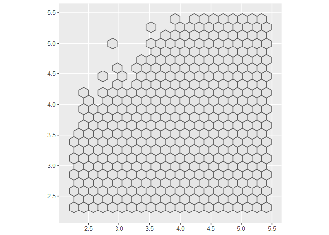
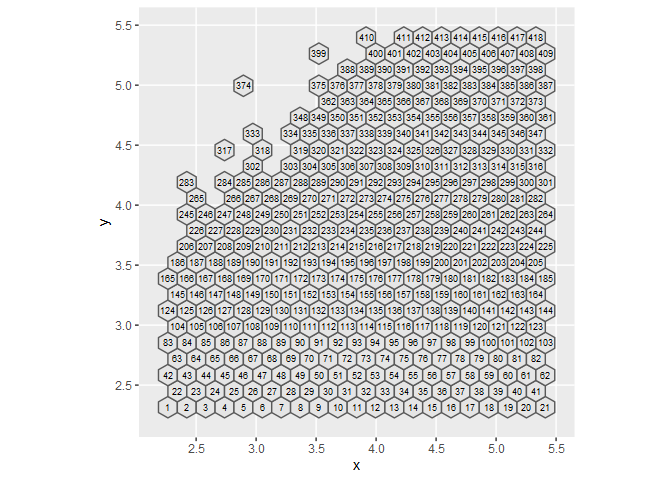
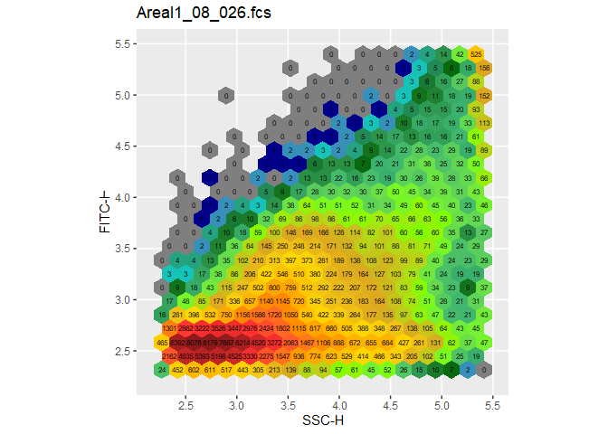
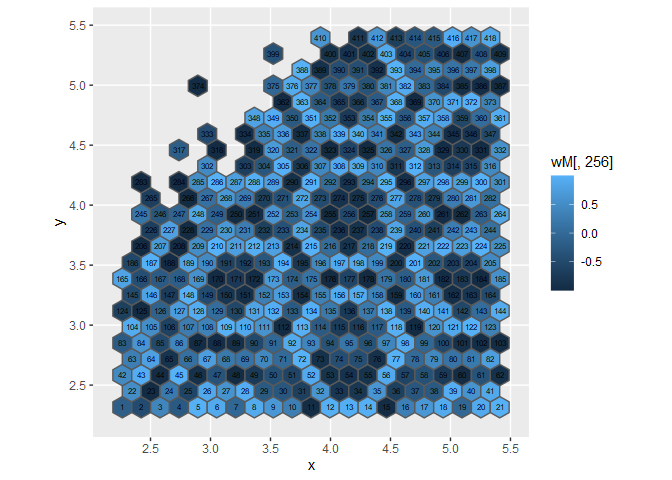

-   [HexTemplatesFCS](#hextemplatesfcs)
    -   [Installation](#installation)
    -   [Quick Start](#quick-start)
        -   [Reading Files and Metadata](#reading-files-and-metadata)
        -   [Creating the HexTemplate](#creating-the-hextemplate)
        -   [Creating the Distance
            Matrix](#creating-the-distance-matrix)
        -   [Analysis of Variance using
            ADONIS](#analysis-of-variance-using-adonis)
        -   [nmds-plot](#nmds-plot)
        -   [Visualizing regional Differences with
            t-scores](#visualizing-regional-differences-with-t-scores)
    -   [HexTemplate](#hextemplate)
    -   [Plotting](#plotting)
    -   [Weights and Distance Matrices](#weights-and-distance-matrices)
        -   [Distance Matrix without adjustments for spatial
            dependencies](#distance-matrix-without-adjustments-for-spatial-dependencies)
        -   [The weightedBray function](#the-weightedbray-function)
        -   [Custom Weight Matrices](#custom-weight-matrices)
        -   [Visualizing Weight Matrices](#visualizing-weight-matrices)
    -   [t-Score Gate Detection](#t-score-gate-detection)

<!-- README.md is generated from README.Rmd. Please edit that file -->
<!-- knitr::knit("README.Rmd") -->

HexTemplatesFCS
===============

<!-- badges: start -->
<!-- badges: end -->

The goal of HexTemplatesFCS is to quickly and easily generate data
structures that make it easy to get statistical output starting from raw
fcs-files and a metadata table. The grid approach is especially useful
if there aren’t any populations clearly visible in the files.

Installation
------------

You can install the development version of HexTemplatesFCS from GitHub
with:

    library(devtools)
    install_github("AG-ESSER/HexTemplatesFCS")

Quick Start
-----------

### Reading Files and Metadata

First we read the fcs-files and the metadata table.

    library(flowCore)

    setwd("C:/Users/student.esser/FACSDATA/FCS_skin_microbiome")  #set working directory
    fcs <- read.flowSet(pattern = ".fcs")                         #read all .fcs-files in directory
    metadata <- read.table("metadata.csv", sep = ";", header = T) #read metadata table
    head(metadata)
    #>   Sample.ID  areal    sex collection_date Exp_ID
    #> 1         1 Areal1   Male      17.08.2020     3S
    #> 2         3 Areal1 Female      19.08.2020     4S
    #> 3         5 Areal1   Male      20.08.2020     6S
    #> 4         7 Areal1 Female      20.08.2020     7S
    #> 5         9 Areal1   Male      20.08.2020     8S
    #> 6        11 Areal1 Female      21.08.2020    10S

### Creating the HexTemplate

Check the available channels:

    colnames(fcs)
    #>  [1] "FSC-A"  "FSC-H"  "SSC-A"  "SSC-H"  "FITC-A" "FITC-H" "APC-A"  "APC-H" 
    #>  [9] "DAPI-A" "DAPI-H" "Time"

Next we create the HexTemplate. Fine tuning of the *HexTemplate*
function is explained in the “HexTemplate”-chapter.

    library(HexTemplatesFCS)

    hexT <- HexTemplate(flowset = fcs, xChannel = "SSC-H", yChannel = "FITC-H", metadata = metadata)

### Creating the Distance Matrix

We can create a distance matrix directly from the HexTemplate using the
*weightedBray* function. It automatically adjusts for spatial
dependencies in the hexagon grid by assigning weights to every
combination of hexagons based on their distance from another. Further
Details and how to create a distance matrix without adjustments are
explained in the “Weights and Distance Matrices”-chapter.

    distM <- weightedBray(hexT)

### Analysis of Variance using ADONIS

The function *adonis* from the *vegan* package makes it possible to
perform an analysis of variance on a distance matrix to test for
significant effects in treatment groups. We can use the *meta.data*
function to access the metadata slot of the HexTemplate.

    library(vegan)
    #> Loading required package: permute
    #> Loading required package: lattice
    #> This is vegan 2.5-6

    adonis(distM ~ areal + sex, data = meta.data(hexT))
    #> 
    #> Call:
    #> adonis(formula = distM ~ areal + sex, data = meta.data(hexT)) 
    #> 
    #> Permutation: free
    #> Number of permutations: 999
    #> 
    #> Terms added sequentially (first to last)
    #> 
    #>           Df SumsOfSqs  MeanSqs F.Model      R2 Pr(>F)  
    #> areal      1   0.18394 0.183936 2.13374 0.07599  0.019 *
    #> sex        1   0.08155 0.081553 0.94605 0.03369  0.395  
    #> Residuals 25   2.15509 0.086204         0.89032         
    #> Total     27   2.42058                  1.00000         
    #> ---
    #> Signif. codes:  0 '***' 0.001 '**' 0.01 '*' 0.05 '.' 0.1 ' ' 1

### nmds-plot

We can see that there is a significant difference between the samples of
the areal metadata group. To visualize the difference between all of the
samples we can use a nmds-plot. For this we can use the *metaMDS*
function that is also included in the *vegan* package.

    nmd <- metaMDS(distM, trace = F)

    ordiplot(nmd, display = "sites")
    ordispider(nmd, groups = meta.data(hexT)[,"areal"])
    ordiellipse(nmd, groups = meta.data(hexT)[,"areal"], label = T, draw = "polygon")

### Visualizing regional Differences with t-scores

Now we might want to know if the significant effect stems from a certain
region within the SSC-H-FITC-H area. For this we calculate t-scores
based on Welch’s t-statistic independently for every hexagon and for
every combination of levels in a given metadata group and use them as a
measurement of difference.

The *tscores* function does this automatically. It returns a data.frame
of t-scores with the columns representing every possible unique
combination of levels in the given metadata group. In this case we have
two levels (Areal1 and Areal2) so the output will be a data.frame with a
single column.

    ts <- tscores(hexT, "areal")

We can visualize the differences between two levels of a metadata group
using the *plot\_tscores* function. We don’t have to worry about
indexing ts because there is only one possible combination of levels.

    plot_tscores(hexT, ts, color = NA)

 In
this case a blue colored hexagon indicates a decrease in event
percentage in this region in the samples of the Areal2 level compared to
Areal1. The big blue region might be something we want to look at more
closely and possibly perform a subsequent FACS analysis where this area
could be sorted and further evaluated. How to automatically detect gates
based on the t-score and how to integrate them in FlowJo-workspaces is
explained in the “t-Score Gate Detection”-chapter.

HexTemplate
-----------

There are some adjustments we can do to the HexTemplates function. We
can change the resolution of the hexagon grid by using the **xbins**
argument that is directly passed to the *hexbin* function from the
*hexbin* package that HexTemplate uses internally to create the grid.
Default is 20 (meaning 21 hexagons on the x-axis). This number should
not be lowered as the *adonis* and *metaMDS* functions are not stable
for lower numbers of hexagons.

Furthermore we can give a function to transform the data to the
**trans\_fun** argument. If no function is given the data will be log10
transformed. If the data should not be transformed at all then
*trans\_fun = return* will do the trick.

The following creates the same HexTemplate that was created in the
“Quick Start”-chapter.

    hexT <- HexTemplate(flowset = fcs,
                        xChannel = "SSC-H",
                        yChannel = "FITC-H",
                        metadata = metadata,
                        xbins = 20,
                        trans_fun = log10)

Plotting
--------

The S3 *plot* method for the HexTemplate class and the *plot\_tscores*
function return *ggplot* objects and are therefore highly customizable.
They use geom\_sf internally to display the hexagons. Additional
arguments passed to geom\_sf can be added to the function call and
additional layers can be added dynamically as to any *ggplot* object.

We can plot the empty grid:

    plot(hexT)

Or fill it with the event percentages of sample no. 5

    plot(hexT, sample = 5)

If additional layers should be added to the plot we first have to load
the *ggplot2* library.

Plot the id of every hexagon

    library(ggplot2)

    plot(hexT) + 
      geom_sf_text(mapping = aes(label = 1:hexT@nHex), size = 2.5)

Plot the number of events in every hexagon for sample no. 5 and hide the
legend

    plot(hexT, 5, color = NA) + 
      geom_sf_text(mapping = aes(label = hexT@counts[[5]]), size = 2) +
      theme(legend.position = "none")

Weights and Distance Matrices
-----------------------------

### Distance Matrix without adjustments for spatial dependencies

First we need to turn the absolute event numbers contained in the
HexTemplate into frequencies. We can do that using the *frequencies*
function. Next we can create a distance matrix using the *vegdist*
function from the *vegan* package in conjunction with the frequency
table.

    freq <- frequencies(hexT)

    library(vegan)
    distM_vegan <- vegdist(freq, method = "bray")

### The weightedBray function

The default way to create a distance matrix from a HexTemplate is the
*weightedBray* function which expands on the Bray-distance by adding in
a weight matrix that contains a weight for every combination of
hexagons. We can give the function a custom weight matrix but the
default weight matrix is calculated with exp(-1\*gamma\*euclDist) where
gamma is a factor controlling the speed of the decline and euclDist is a
matrix containing the euclidean distances between the hexagon’s centers.
We can control the gamma factor directly with the **gamma** argument of
the *weightedBray* function. Default is 8. Lower values increase the
region around any hexagon that is taken into account when calculating
the distance matrix. Higher values make the function behave closer to
the default Bray-distance.

    distM8 <- weightedBray(hexT, gamma = 8)

    distM2 <- weightedBray(hexT, gamma = 2) #bigger region of spatial dependecy

### Custom Weight Matrices

If the default exponential approach is not what we want we can use the
*weightMatrix* function and give it to the **w** argument of the
*weightedBray* function. For the *weightMatrix* function we can choose
between an exponential approach or a discrete approach by calling the
function with either “exp” or “disc” as the **method** argument. If no
custom weight matrix is given then *weightedBray* uses the exponential
approach of the *weightMatrix* function by default.

The following creates the same distance Matrix as in the “Quick
Start”-chapter:

    wM_exp <- weightMatrix(hexT, method = "exp", gamma = 8)
    distM <- weightedBray(hexT, w = wM_exp)

The discrete approach gives us more control over the final matrix by
letting us give a weight for every ranked distance between hexagons to
the **val** argument of the *weightMatrix* function. However this
approach depends on the resolution of the hexagon grid.

    wM_disc <- weightMatrix(hexT, method = "disc", val = c(.5,.25,.25))

### Visualizing Weight Matrices

We can visualize the different weight matrices by plotting the empty
hexagon grid and giving the a column of a weight matrix to the fill
aesthetic of the *plot* function.

In this case we plot the weights of every hexagon relating to hexagon
no. 256 as contained in the default exponential weight matrix.

    wM <- weightMatrix(hexT, method = "exp", gamma = 8)

    plot(hexT, mapping = aes(fill = wM[,256])) + 
      geom_sf_text(aes(label = 1:hexT@nHex), size = 2)

With the discrete approach we can make the weights between hexagons
depend on the ranked distance between them.

    wM <- weightMatrix(hexT, method = "disc", val = c(.5,.25,.25))

    plot(hexT, mapping = aes(fill = wM[,256])) + 
      geom_sf_text(aes(label = 1:hexT@nHex), size = 2)

This way we can also use functions to create more complicated
dependencies if needed.

    wM <- weightMatrix(hexT, method = "disc", val = sin((1:500)*100))

    plot(hexT, mapping = aes(fill = wM[,256])) + 
      geom_sf_text(aes(label = 1:hexT@nHex), size = 2)

t-Score Gate Detection
----------------------
