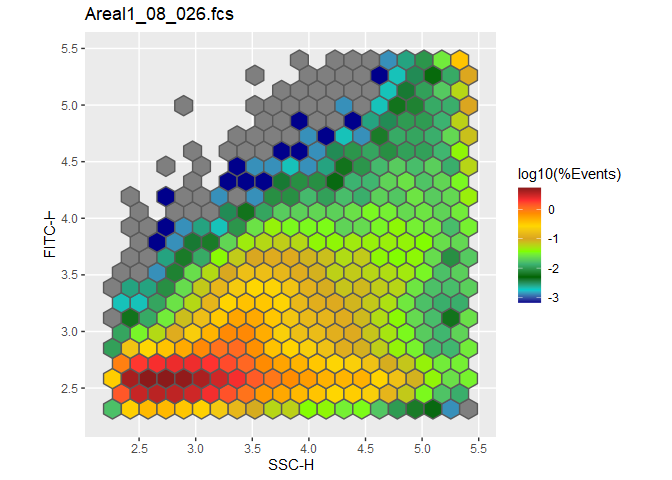

-   [HexTemplatesFCS](#hextemplatesfcs)
    -   [Installation](#installation)
-   [Instructions](#instructions)
    -   [Part 1: Read .fcs-files and
        metadata](#part-1-read-.fcs-files-and-metadata)
    -   [Part 2: Creating necessary data
        structures](#part-2-creating-necessary-data-structures)
        -   [Part 2.1: Creating a hexagon
            template](#part-2.1-creating-a-hexagon-template)
        -   [Part 2.2: Creating a frequency
            table](#part-2.2-creating-a-frequency-table)
        -   [Part 2.3: Creating a distance
            matrix](#part-2.3-creating-a-distance-matrix)
    -   [Part 3: Output](#part-3-output)
        -   [Part 3.1: Plotting the
            template](#part-3.1-plotting-the-template)
        -   [Part 3.2: Calculate and plot
            t-scores](#part-3.2-calculate-and-plot-t-scores)
        -   [Part 3.3: nmds-plot](#part-3.3-nmds-plot)
        -   [Part 3.4: Heatmap](#part-3.4-heatmap)
        -   [Part 3.5: adonis (PERMANOVA)](#part-3.5-adonis-permanova)
    -   [Part 4: Customizing the plots](#part-4-customizing-the-plots)
    -   [Part 5: Additional information](#part-5-additional-information)

<!-- README.md is generated from README.Rmd. Please edit that file -->
<!-- knitr::knit("README.Rmd") -->

HexTemplatesFCS
===============

<!-- badges: start -->
<!-- badges: end -->

The goal of HexTemplatesFCS is to quickly and easily generate data
structures that make it easy to get statistical output starting from raw
fcs-files and a metadata table. The grid approach is especially useful
if there aren’t any populations clearly visible in the files.

Installation
------------

You can install the development version of HexTemplatesFCS from GitHub
with:

    library(devtools)
    install_github("AG-ESSER/HexTemplatesFCS")

Instructions
============

Part 1: Read .fcs-files and metadata
------------------------------------

The .fcs-files should already be cleaned up. The metadata table should
preferably be saved in .csv or any other easy to read format. The rows
of the metadata table should correspond to the .fcs-files in
alphabetical order (e.g. sample\_01.fcs, sample\_02.fcs,…,
sample\_10.fcs). The *flowCore* library is needed for reading .fcs
files.

    library(flowCore)

    setwd("C:/Users/student.esser/FACSDATA/Exp4")                 #set working directory
    fcs <- read.flowSet(pattern = ".fcs")                         #read all .fcs-files in directory
    metadata <- read.table("metadata.csv", sep = ";", header = T) #read metadata table

Example metadata table:

    head(metadata[,1:4])
    #>           ID sample genetic_background    sex
    #> 1  021321//2      1           C57Bl/6J female
    #> 2 021322//13      2           C57Bl/6J female
    #> 3 021323//15      3           C57Bl/6J female
    #> 4 021324//18      4           C57Bl/6J female
    #> 5 021325//20      5           C57Bl/6J female
    #> 6  021326//4      6           C57Bl/6J female

Part 2: Creating necessary data structures
------------------------------------------

### Part 2.1: Creating a hexagon template

Check the available channels:

    colnames(fcs)
    #> [1] "FSC-H"  "SSC-H"  "DAPI-H" "Time"

Create the HexTemplate:

    library(HexTemplatesFCS)

    hexT <- HexTemplate(flowset = fcs, xChannel = "SSC-H", yChannel = "DAPI-H", xbins = 20, metadata = metadata, trans_fun = log10)

Every further output will be based on this template. The *flowset*
argument takes the flowSet we acquired by reading the .fcs-files in part
\\1. For the *xChannel* and the *yChannel* argument select the channels
you are interested in examining. The number of *xbins* correspond to the
number of hexagons on the x-axis - 1. This should be at least 20. Lastly
give your metadata table to the *metadata* argument. Give a function to
transform your data to the trans\_fun argument. Standard is log10. When
no data transformation should be done use *return*. The content of a
HexTemplate can be inspected using *View(hexT)*.

### Part 2.2: Creating a frequency table

    freq <- frequencies(hexT)
    head(freq[,1:4])
    #>                                       [,1]        [,2]       [,3]       [,4]
    #> sample_051518_Tube_001_001.fcs 0.005111111 0.008777778 0.02044444 0.05211111
    #> sample_051518_Tube_002_002.fcs 0.011666667 0.013666667 0.03366667 0.07600000
    #> sample_051518_Tube_003_003.fcs 0.004111111 0.007888889 0.01900000 0.05022222
    #> sample_051518_Tube_004_004.fcs 0.005333333 0.006777778 0.01533333 0.03644444
    #> sample_051518_Tube_005_005.fcs 0.003333333 0.004888889 0.01811111 0.05022222
    #> sample_051518_Tube_006_006.fcs 0.004444444 0.012222222 0.03355556 0.08822222

In the HexTemplate’s count slot, the events that fall into any given
hexagon are stored as absolute values. The *frequencies*-function
recalculates those values in relation to the overall number of events in
a sample. This way comparison between samples is possible independently
of the number of events recorded for each sample.

### Part 2.3: Creating a distance matrix

    distM <- weightedBray(hexT)
    head(as.matrix(distM)[,1:2])
    #>           1         2
    #> 1 0.0000000 0.3388322
    #> 2 0.3388322 0.0000000
    #> 3 0.3357465 0.2974187
    #> 4 0.3247938 0.3106065
    #> 5 0.3466697 0.3148498
    #> 6 0.3742618 0.3906717

Calculate a distance matrix for every combination of samples. The
*weightedBray* function automatically adjusts for spatial dependencies.
If no adjustments should be done the *vegdist* function from the *vegan*
package can be used in conjunction with the frequency table from part
2.2.

Part 3: Output
--------------

### Part 3.1: Plotting the template

Plot the empty template

    plot(hexT)

Plot the template filled with sample no. 5

    plot(hexT, sample = 5)

### Part 3.2: Calculate and plot t-scores

Calculate t-scores between a metadata group for every hexagon and use it
as a measurement of difference.

    ts <- tscores(hexT, "treatment_dose")

This returns a data.frame of t-scores with the columns representing
every possible unique combination of levels in the treatment\_dose
metadata group. Check the indices with *head(ts)*.

    head(ts)
    #>         3,125-0    6,25-0      12,5-0      25-0      50-0 6,25-3,125 12,5-3,125
    #> [1,] -0.2751242 0.2274578 -0.57998178 0.7224675 0.1019336  0.5037482 -0.2860039
    #> [2,]  0.6944512 1.0225454 -0.30495743 0.3895704 0.4476899  0.3756828 -1.0305803
    #> [3,]  2.1894266 1.4679832  0.05669078 0.8756599 1.0498121 -0.2605903 -1.8727017
    #> [4,]  3.1136037 1.5322730  0.87936170 1.2424625 1.6216111 -0.8399287 -1.1324296
    #> [5,]  5.5867544 3.2055839  2.10241390 1.5529765 2.8163271 -0.9964887 -1.4432502
    #> [6,]  3.3009791 3.6056827  2.95330393 1.3673997 2.2944121 -0.7191945 -1.6810506
    #>        25-3,125   50-3,125  12,5-6,25     25-6,25     50-6,25    25-12,5
    #> [1,]  1.0430971  0.4445881 -0.8238255  0.46523884 -0.17223026  1.4764346
    #> [2,] -0.1781815 -0.2379109 -1.3330693 -0.49572718 -0.59606466  0.6296333
    #> [3,] -0.2226368 -0.8945110 -1.3052662 -0.05472895 -0.49220335  0.8139920
    #> [4,] -0.5461003 -1.0016631 -0.3668458  0.08038275 -0.06067205  0.3820174
    #> [5,] -2.0076015 -0.1928362 -0.5181391 -1.00764989  0.48841786 -0.4416519
    #> [6,] -2.5333947 -0.2841835 -1.2447823 -2.44010398  0.28008896 -1.4677772
    #>        50-12,5      50-25
    #> [1,] 0.8899373 -0.7795065
    #> [2,] 0.7678481 -0.0225813
    #> [3,] 0.8980262 -0.2689056
    #> [4,] 0.3338774 -0.1317701
    #> [5,] 0.8756360  1.2735054
    #> [6,] 1.0290481  1.7124040

Plot the differences between two levels (index 5). Use *drop = F* to
show plot title.

    plot_tscores(hexT, ts[,5, drop = F], color = NA)

Automatically create polygon gates based on this index.

    gates <- detectGates(hexT, ts[,5], conc = 2)

Turn into simple features object and plot

    library(sf)
    #> Linking to GEOS 3.8.0, GDAL 3.0.4, PROJ 6.3.1
    library(ggplot2)

    psf <- st_polygon(gates)

    plot_tscores(hexT, ts[,5, drop = F], color = NA) + 
      geom_sf(data = psf, fill = NA)

### Part 3.3: nmds-plot

Visualize the difference between every sample in the template using a
nmds-plots using *vegan’s* *metaMDS*. A single point represents a
sample/.fcs-file. You can use either the frequency table or the distance
matrix as calculated in part 2.

    library(vegan)

    nmd <- metaMDS(distM, trace = F)

    ordiplot(nmd, display = "sites")
    ordispider(nmd, groups = meta.data(hexT)[,"treatment_dose"])
    ordiellipse(nmd, groups = meta.data(hexT)[,"treatment_dose"], label = T, draw = "polygon")

### Part 3.4: Heatmap

Use any heatmap library available and the frequency table we calculated
in part 2 to plot a heatmap. In this example we’re using the *pheatmap*
library:
(<a href="https://slowkow.com/notes/pheatmap-tutorial/" class="uri">https://slowkow.com/notes/pheatmap-tutorial/</a>)

    library(pheatmap) #or any other heatmap library
    library(viridis)  #for color scale

    mat_breaks <- quantile(freq, probs = seq(0, 1, length.out = 10))
    mat_breaks <- mat_breaks[!duplicated(mat_breaks)]

    pheatmap(freq, 
             annotation_row = meta.data(hexT)[,c("treatment_dose"), drop = F], #your metadata groups
             color = plasma(length(mat_breaks)-1),
             breaks = mat_breaks,
             treeheight_col = 0)

### Part 3.5: adonis (PERMANOVA)

Use *vegan’s* *adonis*-function and the distance matrix we calculated in
part 2 to get statistical output about your data. Be aware that the
treatment\_dose metadata group in this example is a character vector.
Every dosage is therefore treated as an independent treatment and the
actual dosage is not taken into account.

    adonis(distM ~ treatment_dose, data = meta.data(hexT))
    #> 
    #> Call:
    #> adonis(formula = distM ~ treatment_dose, data = meta.data(hexT)) 
    #> 
    #> Permutation: free
    #> Number of permutations: 999
    #> 
    #> Terms added sequentially (first to last)
    #> 
    #>                Df SumsOfSqs  MeanSqs F.Model      R2 Pr(>F)   
    #> treatment_dose  5   0.43645 0.087291  1.5735 0.24688  0.002 **
    #> Residuals      24   1.33141 0.055476         0.75312          
    #> Total          29   1.76787                  1.00000          
    #> ---
    #> Signif. codes:  0 '***' 0.001 '**' 0.01 '*' 0.05 '.' 0.1 ' ' 1

Part 4: Customizing the plots
-----------------------------

The *plot* and *plot\_tscores* functions return ggplot objects and are
therefore highly customizable. They use geom\_sf internally to display
the hexagons. Additional arguments passed to geom\_sf can be added to
the function call.

Plot the empty grid filled with random values

    plot(hexT, color = NA, mapping = aes(fill = sample(hexT@nHex)))

Additional geoms and specifications can be added to the plot as in every
ggplot call.

Plot the id of every hexagon

    plot(hexT) + 
      geom_sf_text(mapping = aes(label = 1:hexT@nHex), size = 2.5)

Plot the number of events in every hexagon for sample no. 5 and hide the
legend

    plot(hexT, 5, color = NA) + 
      geom_sf_text(mapping = aes(label = hexT@counts[[5]]), size = 2) +
      theme(legend.position = "none")

Part 5: Additional information
------------------------------

You can save your HexTemplate using *saveRDS* and read it at a later
time using *readRDS*.

    saveRDS(hexT, "hexT.rds")
    hexT <- readRDS("hexT.rds")

You can save the frequency table and the distance matrix to .csv files
to analyze them in alternative statistical applications.

    write.csv(freq, "frequencies.csv")
    write.csv(as.matrix(distM), "distMatrix.csv")

You can use the @ operator to look at the slots of the HexTemplate (or
use *View(hexT)*).

    hexT@nHex #number of hexagons
    #> [1] 382

    hexT@nSamples #number of samples
    #> [1] 30

    hexT@counts[1] #number of events in every hexagon for sample no 1
    #> $sample_051518_Tube_001_001.fcs
    #>   [1]    46    79   184   469   963  1641  2574  3474  2914  1438   436   105
    #>  [13]    32    22     8     6     3     1     3     2     1   149   318   984
    #>  [25]  2335  4812  7205 12328 16765 12948  5402  1249   257    87    35    29
    #>  [37]    18    13     7     9     4     1   107   209   819  2376  4737  7823
    #>  [49] 11520 22148 30629 23091  9762  1767   296    86    45    31    19    10
    #>  [61]    15     9     3   130   441  1514  4004  6475  8644 14566 32681 41276
    #>  [73] 34293 15750  2468   394    87    48    33    32    15    15     8     1
    #>  [85]    34   106   537  2166  4707  6528  8478 18516 41607 46186 46055 22456
    #>  [97]  3014   354    97    42    32    23    22     9     2    27    77   407
    #> [109]  1792  3878  5631  8844 18786 32517 34833 40654 17533  2152   380    92
    #> [121]    37    29    28    10     9     6     4     1    19   157   643  1704
    #> [133]  2844  4734  9104 13018 16178 18005  6943  1198   252    76    49    24
    #> [145]    13    13     5     0     0     1    24   215   750  1276  1997  3825
    #> [157]  6038  8594  9646  4230   973   207    69    34    22    15     4     4
    #> [169]     0     0     0     1    12   170   428   691  1450  2740  4368  5762
    #> [181]  5550  2763   757   167    72    38    18     5    10     0     0     0
    #> [193]     1    11    79   190   438   882  1688  2488  3416  3543  2037   656
    #> [205]   171    64    22    18     4     3     0     0     2     1    35   126
    #> [217]   209   398   795  1192  1854  2090  1371   494   141    48    22    10
    #> [229]     7     0     0     0    15    57    66   111   227   442   874  1207
    #> [241]  1045   355   132    27    18     9     6     0     0     1     2    11
    #> [253]    14    25    89   149   446   678   657   329    77    31    18     5
    #> [265]     0     0     0     0     3     5    21    84   195   378   450   244
    #> [277]    49    18    10     2     0     0     0     1     1     3     8    23
    #> [289]   108   224   327   129    44    15    14     0     0     0     0     1
    #> [301]     6    16    49   155   221   125    33    13     2     0     0     0
    #> [313]     0     0     0     1     0     4    22    71   162    81    27    18
    #> [325]     0     0     0     3     7    61    96    60    13     6     0     0
    #> [337]     0     0     1     1    16    76    37    16     0     0     0     2
    #> [349]    10    35    33    10     0     0     0     0     1     2     6    34
    #> [361]    46     0     0     0     0     0     0     1    21    14     0     0
    #> [373]     0     1    43     0     0     0     0     0     1    19

    hexT@counts[[1]][25] #number of events in hexagon 25 for sample no 1
    #> [1] 2335
